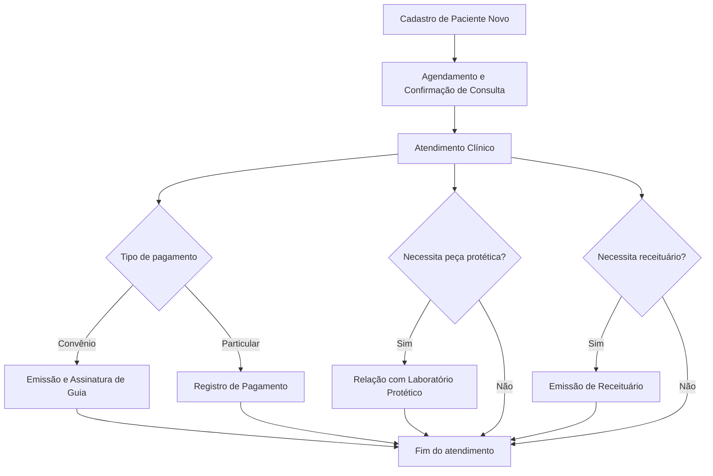
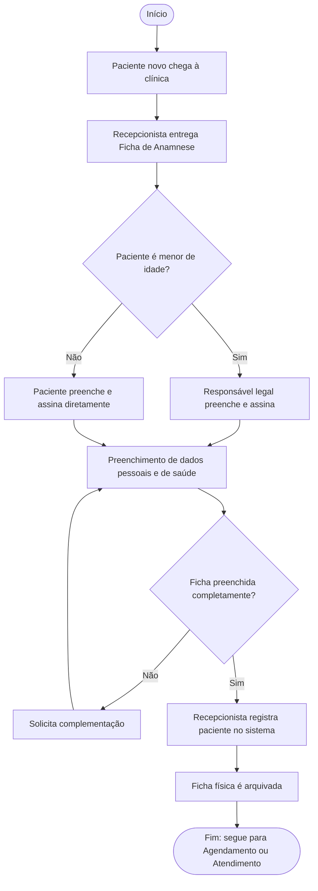
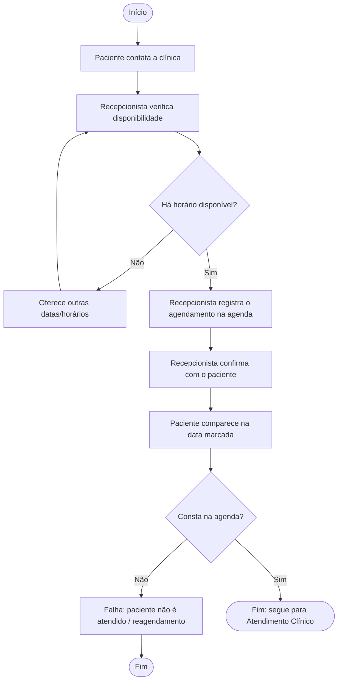
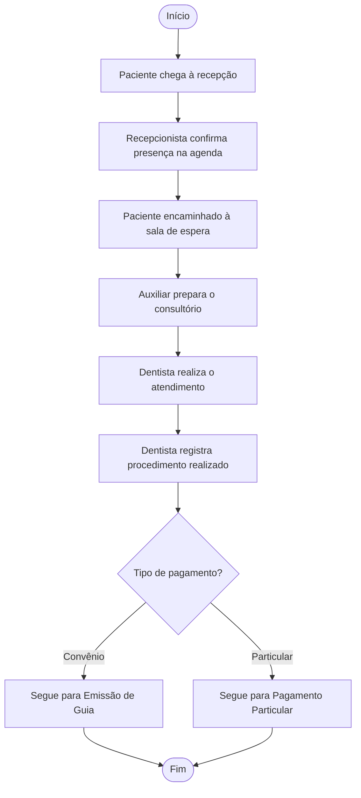
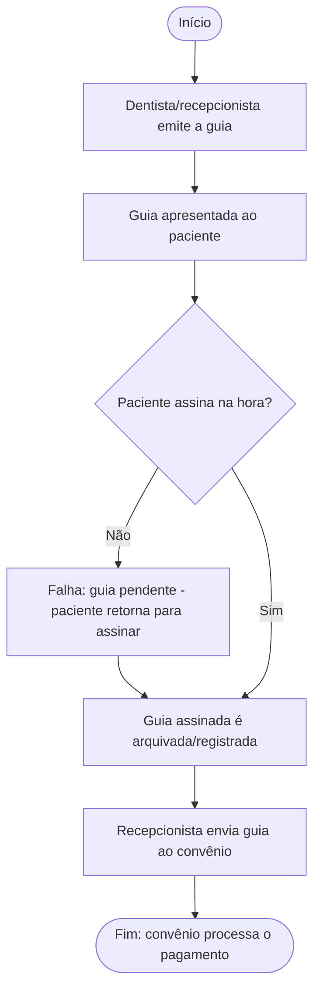
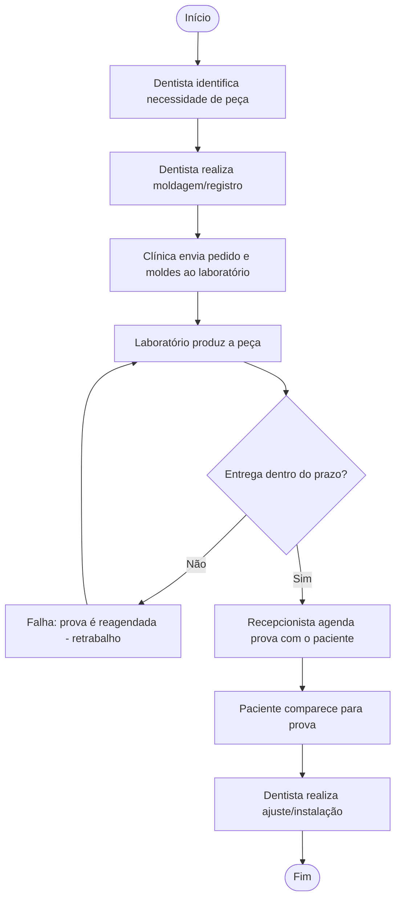
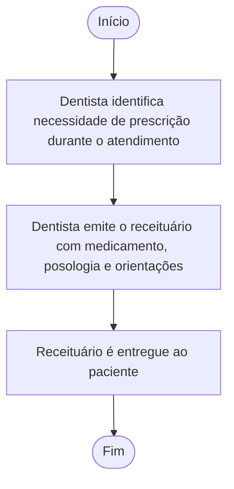
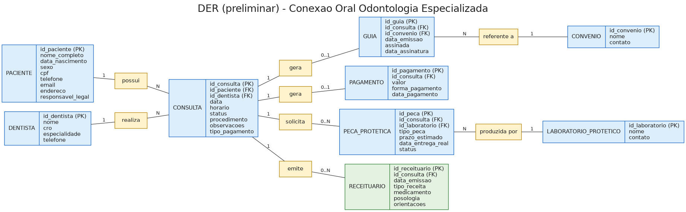

# Sistema de Gestão - Conexão Oral Odontologia Especializada

> Primeira entrega do Projeto Integrador de Modelagem de Dados: do problema real ao Modelo Conceitual de Dados.

## Visão geral

Este projeto apresenta a análise e a modelagem conceitual de um sistema de gestão para a **Conexão Oral — Odontologia Especializada**, clínica odontológica de pequeno/médio porte localizada em São Paulo/SP, com fins lucrativos, que atende tanto pacientes particulares quanto por convênio. O sistema proposto integra o cadastro de pacientes, o agendamento e atendimento clínico, a emissão de guias de convênio, o controle de pagamentos particulares, a relação com laboratórios protéticos externos e a emissão de receituários.

O trabalho segue a sequência proposta pela disciplina:

```
Organização -> Processos -> Problemas -> Requisitos -> Regras de negócio
-> Entidades -> Atributos -> Relacionamentos -> Cardinalidades -> DER
```

---

## 1. Identificação da equipe

| Integrante | RGM |
|---|---|
| Cauã Sureira Gouveia | 48226980 |
| Guilherme Silva Maurício | 48571971 |
| Kaike Cardoso | 48401455 |
| Luiz Felipe Dorneles | 47927879 |
| Vitor Santos Araújo | 48394653 |

| Informação acadêmica | Descrição |
|---|---|
| Curso | Análise e Desenvolvimento de Sistemas |
| Instituição | UNICID |
| Disciplina | Modelagem de Dados |
| Professor | Prof. Cid |

---

## 2. Caracterização da organização

### 2.1 Identificação

| | |
|---|---|
| Nome | Conexão Oral — Odontologia Especializada |
| Natureza | Clínica odontológica com fins lucrativos |
| Localização | Condomínio Edifício Waled Office Tower — R. Coelho Lisboa, 61, Sl 26, Cidade Mãe do Céu, São Paulo - SP, CEP 03323-040 |
| Contato | (11) 93148-6400 |
| Canais de atendimento | Atendimento presencial; contato inicial por telefone/WhatsApp |
| Público principal | Pacientes particulares (maioria) e pacientes de convênio odontológico |
| Horário de funcionamento | Segunda a sexta-feira, das 8h às 18h |

### 2.2 Serviços oferecidos

A clínica conta com 8 dentistas atuando em especialidades distintas: ortodontia, endodontia, implantodontia, harmonização orofacial (HOF), prótese, periodontia e dentística. O atendimento envolve consultas, procedimentos clínicos, emissão de guias para convênios, encaminhamento de peças protéticas a laboratórios externos e emissão de receituários quando há necessidade de prescrição medicamentosa.

### 2.3 Áreas consideradas

- Cadastro de pacientes (incluindo dados de saúde);
- Agendamento e confirmação de consultas;
- Atendimento clínico e registro de procedimentos;
- Faturamento por convênio (guias) e por particular (pagamentos);
- Relação com laboratórios protéticos;
- Emissão de receituários;
- Consultas gerenciais (agenda por dentista/especialidade, histórico de pacientes).

### 2.4 Funcionamento considerado

O paciente novo preenche a Ficha de Anamnese (dados pessoais e de saúde) antes do primeiro atendimento. Para agendar, o paciente entra em contato com a recepção, que verifica disponibilidade e registra a consulta na agenda. No dia marcado, o paciente é atendido pelo dentista responsável, que registra o procedimento realizado. Se o atendimento for por convênio, é emitida uma guia que precisa ser assinada pelo paciente e enviada ao convênio; se for particular, o pagamento é registrado no encerramento da consulta. Quando necessário, o dentista solicita peças protéticas a um laboratório externo ou emite um receituário para o paciente.

### 2.5 Informações essenciais

- Dados pessoais e de saúde dos pacientes (Ficha de Anamnese);
- Dados dos dentistas e suas especialidades;
- Consultas: data, horário, status, procedimento realizado, tipo de pagamento;
- Guias de convênio: emissão, assinatura, envio;
- Convênios parceiros;
- Pagamentos particulares;
- Peças protéticas solicitadas e prazos de entrega;
- Laboratórios protéticos parceiros;
- Receituários emitidos.

---

## 3. Justificativa da escolha

A Conexão Oral foi escolhida porque um dos integrantes do grupo (Guilherme) trabalha na clínica, o que garantiu acesso direto para pesquisa de campo — entrevistas informais e observação real dos processos internos. A clínica tem porte adequado ao trabalho: múltiplos profissionais e especialidades, dois regimes de atendimento (particular e convênio) e processos operacionais reais com falhas identificáveis, o que gera volume e complexidade suficientes para a modelagem conceitual sem tornar o projeto inviável nesta etapa do curso.

---

## 4. Problemas e necessidades identificados

| ID | Problema | Consequência | Necessidade |
|---|---|---|---|
| P01 | Consultas confirmadas verbalmente não são registradas na agenda pela recepção | Paciente comparece à clínica e não é atendido | Registro obrigatório e centralizado do agendamento |
| P02 | Guias de convênio emitidas, mas nem sempre assinadas pelo paciente no momento | Paciente precisa retornar apenas para assinar; atraso no envio ao convênio | Controle do status de assinatura da guia |
| P03 | Falta de controle formal do prazo de entrega de peças protéticas | Paciente comparece para prova e a peça ainda não chegou; retrabalho | Registro de prazo estimado x prazo real de entrega |
| P04 | Ficha de Anamnese existe apenas em papel, sem sistema centralizado | Dificuldade de consulta ao histórico e risco de perda do documento | Registro digital dos dados de cadastro e saúde do paciente |

---

## 5. Processos de negócio

| ID | Processo | Participantes | Evento inicial | Atividades principais | Informações geradas | Resultado |
|---|---|---|---|---|---|---|
| PR01 | Cadastro de Paciente Novo | Paciente (ou responsável legal) e recepcionista | Paciente chega à clínica pela primeira vez | Entregar Ficha de Anamnese, preencher dados pessoais e de saúde, conferir completude | Paciente | Paciente cadastrado no sistema |
| PR02 | Agendamento e Confirmação de Consulta | Paciente e recepcionista | Paciente contata a clínica | Verificar disponibilidade, registrar na agenda, confirmar com o paciente | Consulta (registro inicial) | Consulta agendada e confirmada |
| PR03 | Atendimento Clínico | Paciente, recepcionista, auxiliar e dentista | Paciente comparece na data marcada | Confirmar presença, preparar consultório, realizar procedimento, registrar informações | Consulta (atualizada) | Atendimento concluído |
| PR04 | Emissão e Assinatura de Guia | Recepcionista, dentista e paciente | Atendimento realizado via convênio | Emitir guia, coletar assinatura, enviar ao convênio | Guia | Guia enviada para pagamento |
| PR05 | Relação com Laboratório Protético | Dentista, recepcionista e laboratório | Necessidade de peça protética identificada | Realizar moldagem, enviar pedido, acompanhar prazo, agendar prova | Peça Protética | Peça entregue e instalada |
| PR06 | Emissão de Receituário | Dentista e paciente | Necessidade de prescrição identificada durante o atendimento | Emitir receituário com medicamento, posologia e orientações | Receituário | Paciente recebe a prescrição |

### 5.1 Integração dos processos



---

## 6. Requisitos funcionais

| ID | Requisito funcional |
|---|---|
| RF01 | O sistema deverá cadastrar um novo paciente com dados pessoais e de saúde, com base na Ficha de Anamnese. |
| RF02 | O sistema deverá registrar um responsável legal para pacientes menores de idade. |
| RF03 | O sistema deverá permitir agendar uma consulta, vinculando paciente, dentista, data e horário. |
| RF04 | O sistema deverá permitir confirmar um agendamento de forma visível para a recepção. |
| RF05 | O sistema deverá registrar o atendimento clínico realizado (procedimento, observações, dentista responsável). |
| RF06 | O sistema deverá permitir emitir uma guia de convênio vinculada a uma consulta. |
| RF07 | O sistema deverá registrar a assinatura do paciente na guia, incluindo a data. |
| RF08 | O sistema deverá registrar o envio da guia ao convênio e o status desse envio. |
| RF09 | O sistema deverá registrar pagamentos particulares vinculados a uma consulta. |
| RF10 | O sistema deverá registrar a solicitação de peça protética a um laboratório, com prazo estimado de entrega. |
| RF11 | O sistema deverá atualizar o status da peça protética (solicitada, em produção, entregue, atrasada). |
| RF12 | O sistema deverá permitir agendar a prova/entrega de peça protética com o paciente. |
| RF13 | O sistema deverá permitir consultar o histórico de consultas de um paciente específico. |
| RF14 | O sistema deverá permitir visualizar a agenda por dentista e por especialidade. |
| RF15 | O sistema deverá permitir gerar relatórios de atendimentos por período, dentista e tipo de pagamento. |
| RF16 | O sistema deverá permitir emitir um receituário vinculado a uma consulta, com medicamento, posologia e orientações. |

---

## 7. Requisitos não funcionais

| ID | Categoria | Requisito não funcional |
|---|---|---|
| RNF01 | Segurança/Privacidade | Os dados de saúde dos pacientes deverão ser protegidos, em conformidade com a LGPD. |
| RNF02 | Disponibilidade | O sistema deverá estar disponível durante o horário de funcionamento da clínica (seg-sex, 8h-18h). |
| RNF03 | Usabilidade | O sistema deverá ter interface simples, operável pela recepção sem treinamento técnico avançado. |
| RNF04 | Desempenho | Consultas à agenda e ao histórico de pacientes deverão responder em poucos segundos. |
| RNF05 | Integridade/Backup | O sistema deverá manter backup periódico e integridade dos dados de prontuário e anamnese. |
| RNF06 | Controle de Acesso | O sistema deverá prever perfis de acesso distintos (recepção, dentista, administração). |
| RNF07 | Auditoria | O sistema deverá registrar (log) alterações feitas na agenda, identificando o responsável. |
| RNF08 | Escalabilidade | O sistema deverá suportar o crescimento do número de pacientes, dentistas e especialidades. |

---

## 8. Regras de negócio

| ID | Regra |
|---|---|
| RN01 | Todo paciente novo deve preencher e assinar a Ficha de Anamnese antes do primeiro atendimento. |
| RN02 | Paciente menor de idade deve ter a ficha preenchida e assinada pelo responsável legal. |
| RN03 | Uma consulta só é considerada válida para atendimento se estiver registrada no sistema. |
| RN04 | Toda consulta deve estar vinculada a exatamente um paciente e a exatamente um dentista responsável. |
| RN05 | Uma guia de convênio só pode ser enviada para pagamento após a assinatura do paciente. |
| RN06 | A prova/entrega de peça protética só deve ser agendada após confirmação de entrega pelo laboratório. |
| RN07 | Todo pagamento particular deve ser registrado no momento da finalização da consulta. |
| RN08 | Cada peça protética deve estar vinculada a exatamente um laboratório responsável pela produção. |
| RN09 | Cada consulta deve gerar no máximo um registro financeiro — guia OU pagamento — nunca os dois simultaneamente. |
| RN10 | Um receituário só pode ser emitido vinculado a uma consulta já realizada. |

---

## 9. Restrições e políticas organizacionais

| ID | Restrição ou política |
|---|---|
| RP01 | A clínica funciona apenas de segunda a sexta-feira, das 8h às 18h, restringindo os horários possíveis de agendamento. |
| RP02 | Dados de saúde dos pacientes são informações sensíveis sujeitas à LGPD, exigindo controle de acesso e sigilo. |
| RP03 | A Ficha de Anamnese física deve ser mantida arquivada pela clínica como respaldo jurídico em caso de intercorrências. |
| RP04 | Convênios podem ter regras próprias de prazo e documentação para processamento de pagamento de guias. |

### 9.1 Matriz de rastreabilidade

| Problema | Requisitos | Regras/Políticas | Elementos do modelo | Processo |
|---|---|---|---|---|
| P01 - Agendamento não registrado | RF03, RF04 | RN03, RN04 | CONSULTA | PR02 |
| P02 - Guias não assinadas | RF06, RF07, RF08 | RN05 | GUIA | PR04 |
| P03 - Atrasos do laboratório protético | RF10, RF11, RF12 | RN06, RN08 | PECA_PROTETICA, LABORATORIO_PROTETICO | PR05 |
| P04 - Ficha de Anamnese apenas em papel | RF01, RF02 | RN01, RN02, RP03 | PACIENTE | PR01 |

---

## 10. Fluxogramas

### 10.1 Cadastro de Paciente Novo



### 10.2 Agendamento e Confirmação de Consulta



### 10.3 Atendimento Clínico



### 10.4 Emissão e Assinatura de Guia



### 10.5 Relação com Laboratório Protético



### 10.6 Emissão de Receituário



---

## 11. Entidades

| Entidade | Tipo | Finalidade | Origem na análise |
|---|---|---|---|
| PACIENTE | Forte | Representar a pessoa atendida e seu histórico | Ficha de Anamnese e processo de cadastro (PR01) |
| DENTISTA | Forte | Identificar os profissionais e suas especialidades | Observação direta da equipe clínica (8 dentistas) |
| CONSULTA | Forte | Unificar agendamento e atendimento clínico em um único evento | Processos de Agendamento e Atendimento (PR02/PR03), unificados após validação com o grupo |
| GUIA | Forte | Registrar a cobrança de atendimentos via convênio | Processo de Emissão e Assinatura de Guia (PR04) |
| CONVENIO | Forte | Representar os planos odontológicos parceiros | Processo de Emissão de Guia (PR04) |
| PAGAMENTO | Forte | Registrar a cobrança de atendimentos particulares | Processo de Atendimento Clínico (PR03) |
| PECA_PROTETICA | Forte | Controlar solicitações de peças a laboratórios externos | Processo de Relação com Laboratório Protético (PR05) |
| LABORATORIO_PROTETICO | Forte | Representar os fornecedores externos de peças | Processo de Relação com Laboratório Protético (PR05) |
| RECEITUARIO | Forte | Registrar prescrições médicas emitidas ao paciente | Processo de Emissão de Receituário (PR06) |

> Não foi identificada entidade fraca ou associativa nesta modelagem. Todas as entidades possuem identificador próprio.

---

## 12. Atributos

| Entidade | Principais atributos |
|---|---|
| PACIENTE | `id_paciente`, `nome_completo`, `data_nascimento`, `sexo`, `cpf`, `rg`, `profissao`, `estado_civil`, `endereco`, `telefone`, `email`, `responsavel_legal`, `historico_saude`, `data_cadastro` |
| DENTISTA | `id_dentista`, `nome`, `cro`, `especialidade`, `telefone` |
| CONSULTA | `id_consulta`, `id_paciente`, `id_dentista`, `data`, `horario`, `status`, `procedimento`, `observacoes`, `tipo_pagamento` |
| GUIA | `id_guia`, `id_consulta`, `id_convenio`, `data_emissao`, `assinada`, `data_assinatura` |
| CONVENIO | `id_convenio`, `nome`, `contato` |
| PAGAMENTO | `id_pagamento`, `id_consulta`, `valor`, `forma_pagamento`, `data_pagamento` |
| PECA_PROTETICA | `id_peca`, `id_consulta`, `id_laboratorio`, `tipo_peca`, `prazo_estimado`, `data_entrega_real`, `status` |
| LABORATORIO_PROTETICO | `id_laboratorio`, `nome`, `contato` |
| RECEITUARIO | `id_receituario`, `id_consulta`, `data_emissao`, `tipo_receita`, `medicamento`, `posologia`, `orientacoes` |

### 12.1 Classificação dos atributos

| Classificação | Exemplos | Justificativa |
|---|---|---|
| Identificador | `id_paciente`, `id_consulta`, `id_guia` | Distingue cada ocorrência da entidade. |
| Simples | `cpf`, `status`, `valor`, `tipo_pagamento`, `assinada` | Possui um único valor no contexto da ocorrência. |
| Composto | `endereco` (rua/número/bairro/CEP), `responsavel_legal` (nome/CPF do responsável) | Podem ser divididos em partes menores com significado próprio. |
| Multivalorado | `historico_saude` | Reúne várias respostas da avaliação de saúde da Ficha de Anamnese (alergias, doenças, medicações, etc.). |
| Derivado | *(nenhum identificado nesta etapa)* | O modelo conceitual preliminar não apresenta atributos calculados a partir de outros; essa análise poderá ser revisitada no modelo lógico. |

---

## 13. Relacionamentos

| Relacionamento | Significado |
|---|---|
| PACIENTE possui CONSULTA | Liga o paciente às consultas que ele agenda ao longo do tempo. |
| DENTISTA realiza CONSULTA | Identifica o profissional responsável pela consulta. |
| CONSULTA gera GUIA | Registra a cobrança quando a consulta é por convênio. |
| CONSULTA gera PAGAMENTO | Registra a cobrança quando a consulta é particular. |
| CONVENIO é referente a GUIA | Liga a guia ao plano odontológico correspondente. |
| CONSULTA solicita PECA_PROTETICA | Registra a solicitação de peça(s) originada em uma consulta. |
| LABORATORIO_PROTETICO produz PECA_PROTETICA | Identifica o laboratório responsável pela peça. |
| CONSULTA emite RECEITUARIO | Liga a prescrição médica à consulta que a originou. |

### 13.1 Relacionamentos N:N e entidades associativas

Não foi identificado relacionamento N:N direto nesta modelagem. A entidade CONSULTA já atua como elo entre PACIENTE e DENTISTA (cada consulta se refere a exatamente um paciente e um dentista), preenchendo naturalmente o papel que uma entidade associativa teria em outros modelos, sem necessidade de uma entidade adicional.

---

## 14. Cardinalidades

| Entidade A | Cardinalidade A | Relacionamento | Cardinalidade B | Entidade B | Base |
|---|---|---|---|---|---|
| PACIENTE | (0,N) | possui | (1,1) | CONSULTA | RN04 |
| DENTISTA | (0,N) | realiza | (1,1) | CONSULTA | RN04 |
| CONSULTA | (0,1) | gera | (1,1) | GUIA | RN09 |
| CONSULTA | (0,1) | gera | (1,1) | PAGAMENTO | RN09 |
| CONVENIO | (0,N) | é referente a | (1,1) | GUIA | RP04 |
| CONSULTA | (0,N) | solicita | (1,1) | PECA_PROTETICA | RN08 |
| LABORATORIO_PROTETICO | (0,N) | produz | (1,1) | PECA_PROTETICA | RN08 |
| CONSULTA | (0,N) | emite | (1,1) | RECEITUARIO | RN10 |

---

## 15. Dicionário de dados conceitual preliminar

O dicionário permanece no nível conceitual, concentrando-se em identificar, descrever, classificar e associar regras aos atributos. O conteúdo completo está em [docs/dicionario-dados-conceitual.md](docs/dicionario-dados-conceitual.md).

Exemplo:

| Entidade | Atributo | Classificação | Descrição | Regra/observação |
|---|---|---|---|---|
| PACIENTE | `id_paciente` | Identificador | Identifica unicamente o paciente. | Não pode se repetir. |
| PACIENTE | `nome_completo` | Simples | Nome completo do paciente. | Obrigatório. |
| PACIENTE | `historico_saude` | Multivalorado | Respostas da avaliação de saúde. | Obrigatório antes do primeiro atendimento (RN01). |
| CONSULTA | `status` | Simples (domínio fechado) | Situação da consulta. | Valores: agendada, confirmada, realizada, não compareceu, cancelada. |

> Exemplos de valores usados no dicionário completo são fictícios, conforme exigido pela disciplina.

---

## 16. Diagrama Entidade-Relacionamento - DER

O DER preliminar utiliza uma **variação simplificada da notação de Chen**: as entidades são representadas em retângulos (com os atributos listados dentro de cada caixa) e os relacionamentos são representados também em retângulos (ao invés do losango tradicional), conectados por linhas com as cardinalidades indicadas nas extremidades.



- [Abrir imagem em tamanho maior](der/DER_conexao_oral.png)

### 16.1 Legenda

- Retângulo azul: entidade;
- Retângulo amarelo: relacionamento;
- Atributos listados dentro da caixa da entidade, com `(PK)` indicando chave primária e `(FK)` indicando chave estrangeira;
- Valores como `1`, `N`, `0..1` e `0..N` nas extremidades das linhas: cardinalidade mínima e máxima simplificada.

> Observação: por se tratar do modelo conceitual preliminar, os identificadores de chave primária e estrangeira já aparecem indicados dentro de cada entidade para facilitar a leitura, embora, na notação de Chen tradicional, esse detalhamento seja próprio do modelo lógico.

---

## 17. Justificativas técnicas

### 17.1 Unificação de Agendamento e Atendimento em uma única entidade (CONSULTA)

Inicialmente havia sido considerada a separação entre uma entidade de agendamento e uma entidade de atendimento clínico, sob a hipótese de que uma consulta marcada nem sempre se converte em atendimento efetivo. Após validação com o grupo, essa hipótese foi descartada: na prática da Conexão Oral, agendar e atender são tratados como um único evento operacional. Por isso, optou-se por uma única entidade CONSULTA, cujo atributo `status` (agendada, confirmada, realizada, não compareceu, cancelada) é suficiente para acompanhar o ciclo de vida do evento — inclusive para sinalizar o problema real relatado (P01) de consultas confirmadas verbalmente, mas não registradas no sistema.

### 17.2 Separação entre GUIA e PAGAMENTO

Avaliou-se a alternativa de unificar os dois em uma única entidade de "cobrança" com um atributo de tipo. Essa alternativa foi descartada porque GUIA e PAGAMENTO têm atributos e regras de negócio distintos (GUIA depende de CONVENIO e de assinatura; PAGAMENTO depende apenas de forma de pagamento e valor). Manter entidades separadas evita atributos nulos desnecessários e reflete com fidelidade os dois fluxos observados na clínica. A cardinalidade (0,1) de CONSULTA para ambas reflete a regra confirmada com o grupo (RN09): cada consulta gera exatamente um desses dois registros, nunca ambos.

### 17.3 PECA_PROTETICA como entidade própria

Como uma mesma consulta pode gerar mais de uma solicitação de peça (por exemplo, múltiplos dentes trabalhados na mesma consulta), tratar isso como atributo simples de CONSULTA geraria um atributo multivalorado, violando a forma normal. Por isso, criou-se uma entidade separada com relacionamento (0,N), permitindo registrar `prazo_estimado` e `data_entrega_real` — essenciais para dar visibilidade ao problema de atrasos relatado (P03).

### 17.4 CONVENIO e LABORATORIO_PROTETICO como entidades independentes

Ambos poderiam, em tese, ser modelados como atributos de texto dentro de GUIA e PECA_PROTETICA, respectivamente. Optou-se por entidades próprias porque a clínica trabalha com múltiplos laboratórios e múltiplos convênios de forma recorrente, evitando redundância de dados e permitindo relatórios futuros, como taxa de atraso por laboratório ou volume de guias por convênio.

### 17.5 DENTISTA como entidade separada

Como a clínica tem 8 dentistas com especialidades diferentes, essa separação permite funcionalidades como "agenda por especialidade" (RF14) sem duplicar informações do profissional em cada consulta.

### 17.6 RECEITUARIO como entidade própria

Uma consulta pode gerar zero, um ou mais receituários (por exemplo, mais de um medicamento prescrito em ocasiões diferentes), por isso optou-se por uma entidade própria, vinculada à consulta que a originou, em vez de um atributo dentro de CONSULTA.

---

## 18. Conclusão

A análise da Conexão Oral demonstrou que uma clínica odontológica de médio porte, com múltiplas especialidades e dois regimes de atendimento (particular e convênio), depende da integração de várias informações hoje dispersas entre agenda, papel e comunicação verbal. O modelo proposto conecta pacientes, dentistas, consultas, guias, convênios, pagamentos, peças protéticas, laboratórios e receituários.

Os problemas identificados na pesquisa de campo sustentam os requisitos e regras de negócio, que por sua vez sustentam as entidades, atributos, relacionamentos e cardinalidades do modelo. O DER não é um desenho isolado, mas a consequência direta da análise do funcionamento real observado na clínica — incluindo uma correção importante feita após validação do grupo (a unificação de Agendamento e Atendimento), que evidencia a importância da revisão crítica do conteúdo apoiado por IA.

Esta entrega fornece a base para as próximas etapas do projeto: modelo lógico, normalização, definição dos tipos de dados, modelo físico e implementação do banco de dados.

---

## 19. Uso de Inteligência Artificial

O grupo utilizou o **Claude (Anthropic)** em várias etapas da elaboração deste README.

### Uso 1 — Redação da Caracterização da Organização

| Item | Registro |
|---|---|
| **Ferramenta e etapa** | Claude — redação da Seção 2 (Caracterização da Organização). |
| **Motivação** | O grupo já tinha as informações levantadas em campo, mas precisava organizá-las na linguagem técnica exigida. |
| **Prompt(s) utilizados** | Descrição em texto livre da clínica: número de dentistas e especialidades, funcionários, volume de pacientes, problemas observados, motivo da escolha e dados de contato. |
| **Resposta recebida** | Texto estruturado nos tópicos exigidos pelo modelo. |
| **Fontes consultadas e verificadas** | Nenhuma fonte externa; informações vieram da pesquisa de campo do grupo. |
| **Trechos rejeitados ou corrigidos** | Nenhum nesta etapa. |
| **Justificativa da escolha final** | O texto refletia fielmente as informações fornecidas. |
| **Reflexão crítica** | Toda a precisão do conteúdo depende do relato do grupo; qualquer imprecisão se propagaria ao documento. |

### Uso 2 — Processos de Negócio e Fluxogramas

| Item | Registro |
|---|---|
| **Ferramenta e etapa** | Claude — elaboração dos processos de negócio e dos fluxogramas (inicialmente em imagem, posteriormente convertidos para Mermaid). |
| **Motivação** | Estruturar os relatos verbais do grupo em processos formais e fluxogramas. |
| **Prompt(s) utilizados** | Pedido para "montar o passo a passo" dos processos, envio da Ficha de Anamnese para identificar o processo de cadastro, e posteriormente pedido de conversão dos fluxogramas para o formato Mermaid, seguindo o padrão usado por outro grupo da turma. |
| **Resposta recebida** | Passo a passo textual de 6 processos e os respectivos fluxogramas. |
| **Fontes consultadas e verificadas** | Ficha de Anamnese (documento interno da clínica, fornecido pelo grupo). |
| **Trechos rejeitados ou corrigidos** | Nenhum; grupo optou por manter a ordem dos passos originalmente proposta. |
| **Justificativa da escolha final** | Os fluxos correspondem aos problemas relatados na pesquisa de campo. |
| **Reflexão crítica** | A IA não tem conhecimento de eventuais exceções não relatadas pelo grupo (ex.: atendimentos de urgência). |

### Uso 3 — Modelagem Conceitual, DER e Justificativa Técnica

| Item | Registro |
|---|---|
| **Ferramenta e etapa** | Claude — elaboração e revisão de Requisitos, Regras de Negócio, Dicionário de Dados, Modelagem Conceitual, DER e Justificativa Técnica. |
| **Motivação** | Derivar o modelo de dados a partir dos processos já mapeados e reestruturar o README no formato adotado pela disciplina. |
| **Prompt(s) utilizados** | Pedidos sucessivos para preencher todas as seções, revisar cada uma com o grupo, ajustar o DER (relacionamentos em retângulo) e, por fim, reestruturar todo o documento seguindo o modelo de outro grupo da turma. |
| **Resposta recebida** | Modelo com 9 entidades, dicionário de dados completo, DER preliminar (gerado via script) e justificativas técnicas para cada decisão de modelagem. |
| **Fontes consultadas e verificadas** | README de outro grupo da turma (usado como referência de formato, não de conteúdo), Ficha de Anamnese da clínica. |
| **Trechos rejeitados ou corrigidos** | O grupo identificou que a IA havia inicialmente separado CONSULTA e ATENDIMENTO com base na hipótese de que uma consulta agendada nem sempre vira atendimento — mas na prática da clínica os dois são tratados como um único evento. As entidades foram fundidas em CONSULTA, e o DER, o dicionário de dados e a justificativa técnica foram regenerados para refletir essa correção. |
| **Justificativa da escolha final** | O grupo manteve a estrutura geral proposta (GUIA/PAGAMENTO separados, PECA_PROTETICA e RECEITUARIO como entidades próprias, CONVENIO e LABORATORIO_PROTETICO independentes) por refletirem os fluxos reais da clínica; a fusão de CONSULTA/ATENDIMENTO foi a correção necessária após validação do grupo. |
| **Reflexão crítica** | O modelo inicial partiu de suposições genéricas de sistemas de clínicas em geral, que não correspondiam exatamente à prática da Conexão Oral. Isso reforça a necessidade de validação humana de qualquer modelo de dados gerado com apoio de IA antes de considerá-lo definitivo. |

---

## Arquivos da entrega

- [DER conceitual em PNG](der/DER_conexao_oral.png)
- [Dicionário de dados conceitual completo](docs/dicionario-dados-conceitual.md)
- Fluxogramas em Mermaid (embutidos na Seção 10 deste README)
- [Ficha de Anamnese (documento interno de referência)](evidencias/Ficha_de_Anamnese.docx)
- [Fotos da visita à clínica](evidencias/)

## Fontes consultadas

- [Instagram da Conexão Oral](https://www.instagram.com/conexaoral)
- [Google Maps da Conexão Oral](https://maps.app.goo.gl/yEyMq8viZV71aAuk8)
- Ficha de Anamnese da clínica (documento interno fornecido pelo grupo)
- Pesquisa de campo e entrevista informal com integrante do grupo que trabalha na clínica (Guilherme Silva Maurício)
